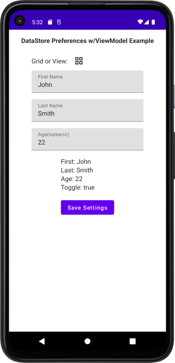

# DataStore Preferences with ViewModel
- This is a learning project
 
### Just an app for me to learn DataStore Preferences concepts
- Here we use a viewModel to manage the App State
- Display Screen
  - Data is initialized in viewModel from saved preferences
  - Displays 3 Text Fields
  - Layout Choice Icon(toggles)
  - Save Settings Button
- on Save Settings Button Click
  - we update the 3 textfield and layout choice to preferences in the viewModel

  

ref: demo-datastore-preferences-with-viewmodel-app-android-kotlin-compose